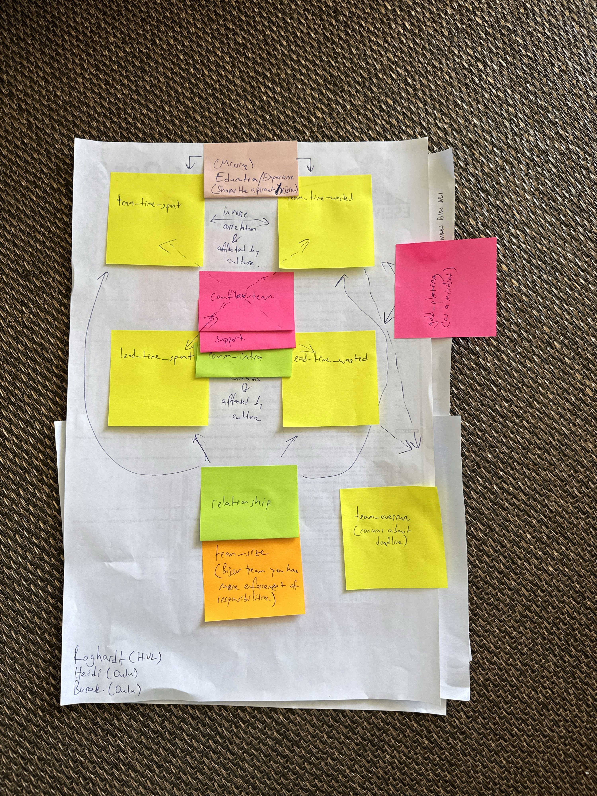

```{r setup, include=FALSE}
knitr::opts_chunk$set(echo = TRUE)

library(tidyverse)
library(patchwork)
library(ggdag)
```

This file contains the analysis of one of the causal propositions formulated by participants in the [interactive session at ISERN'25](https://conf.researchr.org/details/esem-2025/esem-2025-isern---annual-meeting-/4/Naming-the-Pain-in-Requirements-Engineering-NaPiRE-).

## Proposition

Roghardt, Heidi Hietala, and Burak Turhan proposed the following proposition.



### Variables

This proposition contains the following variables from the available variable catalogs (where the "Group"-column refers to the respective cluster of variables):

| Code | Group | Description | Variable |
|---|---|---|---|
| `team-time-spent` | Analysis | The project members collectively agreed that we have spent enough time on requirements analysis. | `v_564` |
| `team-time-wasted` | Analysis | The project members collectively agreed that we have wasted enough time on requirements analysis | `v_565` |
| `lead-time-spent` | Analysis | The project leader decided that we have spent enough time on requirements analysis. | `v_561` |
| `lead-time-wasted` | Analysis | The project leader decided that we have wasted enough time on requirements analysis | `v_562` |
| `gold-plating` | Problems | Gold plating (implementation of features without corresponding requirements) | `v_395` |
| `comflaw-team` | Problems | Communication flaws within our project team | `v_385` |
| `comm.intra` | Communication | How would you rate the quality of communication inside your team? | `v_359` |
| `relationship` | Communication | How would you rate the relationship between your project's team and its customer? | `v_25` |
| `team-overrun` | Analysis | The project members collectively agreed that if we don't start implementation now, we would not finish implementation in time. | `v_566` |
| `team-size` | Demographics | How many people are involved in your project? | `v_3` |

Additionally, the participants considered the following variables to be relevant yet not available in the data:

| Code | Assumed Meaning |
|---|---|
| `education` | The level of education that members of a team have enjoyed |
| `experience` | The degree of experience that the members of a team have |

### Directed Acyclic Graph

The proposition can be formalized as the following directed, acyclic graph (DAG).

```{r specify-dag}
dag <- dagify(
  team.time.spent ~ comflawteam + relationship + education + experience,
  team.time.wasted ~ comflawteam + relationship + education + experience + gold.plating,
  lead.time.spent ~ comflawteam + relationship + team.size,
  lead.time.wasted ~ comflawteam + relationship + team.size + gold.plating,
  team.overrun ~ team.time.wasted + lead.time.wasted,

  exposure = "relationship",
  outcome = c("team.time.spent", "team.time.wasted", "lead.time.spent", "lead.time.wasted"),
  latent = c("education", "experience"),
  
  labels = c(
    team.time.spent = "team-time-spent", team.time.wasted = "team-time-wasted",
    lead.time.spent = "lead-time-spent", lead.time.wasted = "lead-time-waster",
    comflawteam = "comflawteam", gold.plating = "gold-plating",
    relationship = "relationship", team.size = "team.size",
    education = "education", experience = "experience",
    team.overrun = "team-overrun"
  ),
  coords = list(
    x = c(team.time.spent = 0, team.time.wasted = 2, 
          lead.time.spent = 0, lead.time.wasted = 2,
          comflawteam = 1, gold.plating = 3,
          relationship = 1, team.size = 1,
          education = 1, experience = 1,
          team.overrun = 3),
    y = c(team.time.spent = 3, team.time.wasted = 3, 
          lead.time.spent = 1, lead.time.wasted = 1,
          comflawteam = 2, gold.plating = 2,
          relationship = 0, team.size = -1,
          education = 4, experience = 5,
          team.overrun = 0)
  )
)

 ggdag_status(dag, use_labels = "label", text = FALSE) +
   theme_dag() +
   theme(legend.position = "bottom") +
   labs(fill = "Variable type", color = "Variable type")
```

The participants noted the following relationships on their contribution:

- $\text{education} \rightarrow \text{team-time-spent}$ (and similar for all outgoing arrows from education and experience): "shapes the approach/vision"
- $\text{team-time-spent} \leftrightarrow \text{team-time-wasted}$: "inverse correlation & affected by culture"
- $\text{lead-time-spent} \leftrightarrow \text{lead-time-wasted}$: "inverse correlation & affected by culture"
- $\text{team-size} \rightarrow \text{lead-time-spent}$ (and similar for the effect on $\text{lead-time-wasted}$): "bigger teams you have more enforcement of responsibilities"
