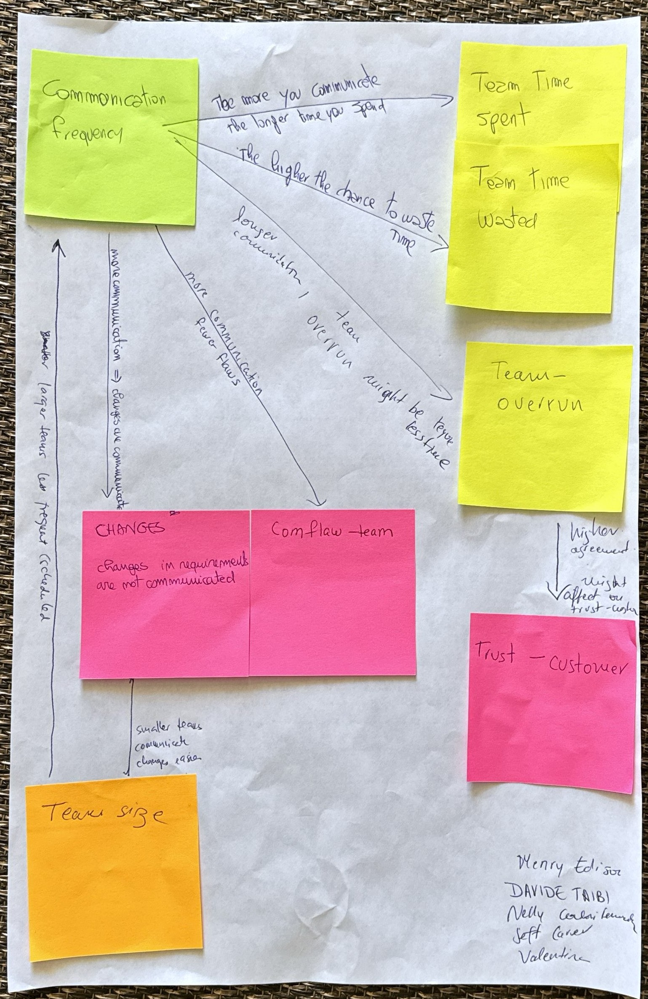

```{r setup, include=FALSE}
knitr::opts_chunk$set(echo = TRUE)

library(tidyverse)
library(patchwork)
library(ggdag)
```

This file contains the analysis of one of the causal propositions formulated by participants in the [interactive session at ISERN'25](https://conf.researchr.org/details/esem-2025/esem-2025-isern---annual-meeting-/4/Naming-the-Pain-in-Requirements-Engineering-NaPiRE-).

## Proposition

Henry Edison, Davide Taibi, Nelly Condori-Fernandez, Jeff Carver, and Valentina Lenarduzzi proposed the following proposition.



### Variables

This proposition contains the following variables from the available variable catalogs (where the "Group"-column refers to the respective cluster of variables):

| Code | Group | Description | Variable |
|---|---|---|---|
| `frequency` | Communication | How often do members of your team meet, informally by chance meeting or in announced meetings? | `v_380` |
| `team-time-spent` | Analysis | The project members collectively agreed that we have spent enough time on requirements analysis. | `v_564` |
| `team-time-wasted` | Analysis | The project members collectively agreed that we have wasted enough time on requirements analysis | `v_565` |
| `team-overrun` | Analysis | The project members collectively agreed that if we don't start implementation now, we would not finish implementation in time. | `v_566` |
| `changes` | Problems | Changes in requirements are not communicated | `v_410` |
| `comflaw-team` | Problems | Communication flaws within our project team | `v_385` |
| `trust-customer` | Problems | Lack of trust between our project team members and stakeholder or customer | `v_411` |
| `team-size` | Demographics | How many people are involved in your project? | `v_3` |

### Directed Acyclic Graph

The proposition can be formalized as the following directed, acyclic graph (DAG).

```{r specify-dag}
dag <- dagify(
  frequency ~ team.size,
  team.time.spent ~ frequency,
  team.time.wasted ~ frequency,
  changes ~ frequency + team.size,
  comflaw.team ~ frequency,
  team.overrun ~ frequency,
  trust.customer ~ team.overrun,

  exposure = "frequency",
  outcome = c("changes", "comflaw.team", "trust.customer"),
  
  labels = c(
    team.time.spent = "team-time-spent", team.time.wasted = "team-time-wasted",
    frequency = "frequency",
    changes = "changes", comflaw.team = "comflaw-team",
    team.size = "team-size",
    team.overrun = "team-overrun", trust.customer = "trust-customer"
  ),
  coords = list(
    x = c(frequency = 0, team.time.spent = 2, team.time.wasted = 2,
          changes = 0.5, comflaw.team = 1, team.size = 0,
          team.overrun = 2, trust.customer = 2),
    y = c(frequency = 3, team.time.spent = 3.5, team.time.wasted = 2.5,
          changes = 1.5, comflaw.team = 1.5, team.size = 0.5,
          team.overrun = 1.5, trust.customer = 0.5)
  )
)

 ggdag_status(dag, use_labels = "label", text = FALSE) +
   theme_dag() +
   theme(legend.position = "bottom") +
   labs(fill = "Variable type", color = "Variable type")
```

The participants commented on the following relationships on their contribution:

- $\text{team-size} \rightarrow \text{frequency}$: larger teams have fewer scheduled meetings ("larger teams less frequent scheduled")
- $\text{team-size} \rightarrow \text{changes}$: "smaller teams communicate changes easier"
- $\text{frequency} \rightarrow \text{changes}$: "more communication $\Rightarrow$ changes are communicated"
- $\text{frequency} \rightarrow \text{comflaw-team}$: "more communication fewer flaws"

- $\text{frequency} \rightarrow \text{team-time-spent}$: "The more you communicate the longer time you spend"
- $\text{frequency} \rightarrow \text{team-time-wasted}$: "... the higher the chance to waste time"
- $\text{frequency} \rightarrow \text{team-overrun}$: "longer communication, team overrun might be require less time"[^1]
- $\text{team-overrun} \rightarrow \text{trust-customer}$: "higher agreement might affect trust-customer"

### Hypotheses

From the DAG, we can test several causal hypotheses.
For the sake of conciseness, we focus on hypotheses about the *causes of problems*, i.e., connections in the DAG where the outcome variable is from the group "Problem".
In the DAG at hand, this entails the following hypotheses:

- $H_1^{P2}$: *Communication frequency* impacts that *changes in requirements are not communicated*.
- $H_2^{P2}$: *Communication frequency* cause *communication flaws within our project team*.
- $H_3^{P2}$: If *he project members collectively agreed that if we don't start implementation now, we would not finish implementation in time*, this causes a *lack of trust between our project team members and stakeholder or customer*.

All hypotheses are formulated with the assumption of an impact. 
Since we are not using a frequentist analysis framework, there is no need for the arbitrary "null-hypothesis" formulation.
The exponent $H^{P2}$ indicates that the respective hypothesis originated from proposition 2.

[^1]: It's unclear what the authors of the DAG meant by this explanation.
