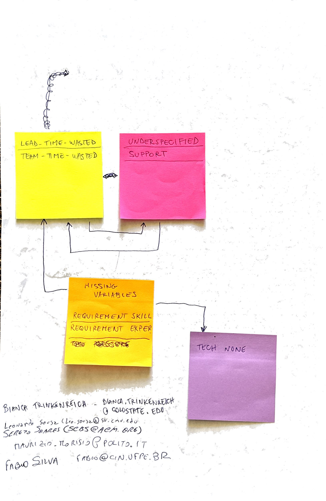

```{r setup, include=FALSE}
knitr::opts_chunk$set(echo = TRUE)

library(tidyverse)
library(patchwork)
library(ggdag)
```

This file contains the analysis of one of the causal propositions formulated by participants in the [interactive session at ISERN'25](https://conf.researchr.org/details/esem-2025/esem-2025-isern---annual-meeting-/4/Naming-the-Pain-in-Requirements-Engineering-NaPiRE-).

## Proposition

Bianca Trinkenreich, Leonardo Sousz, Sergio Soares, Maurizio Morisio, and Fabio Silva proposed the following proposition.



### Variables

This proposition contains the following variables from the available variable catalogs (where the "Group"-column refers to the respective cluster of variables):

| Code | Group | Description | Variable |
|---|---|---|---|
| `lead-time-wasted` | Analysis | The project leader decided that we have wasted enough time on requirements analysis | `v_562` |
| `team-time-wasted` | Analysis | The project members collectively agreed that we have wasted enough time on requirements analysis | `v_565` |
| `underspecified` | Problems | Underspecified requirements that are too abstract and allow for various interpretations | `v_402`  |
| `support` | Problems | Insufficient support by our project lead | `v_389` |
| `tech.none` | Elicitation | Which techniques are employed to elicit requirements in your project? $\rightarrow$ We do not elicit requirements (outsourcing) | `v_47` |

Additionally, the participants considered the following variables to be relevant yet not available in the data:

| Code | Assumed Meaning |
|---|---|
| `requirement-skill` | Skill of a requirements engineer |
| `requirement-exper` | Experience of a requirements engineer |

### Directed Acyclic Graph

The proposition can be formalized as the following directed, acyclic graph (DAG).

```{r specify-dag}
dag <- dagify(
  underspecified ~ lead.time.wasted + team.time.wasted,
  support ~ lead.time.wasted + team.time.wasted,
  lead.time.wasted ~ requirement.skill + requirement.exper,
  team.time.wasted ~ requirement.skill + requirement.exper,
  tech.none ~ requirement.skill + requirement.exper,
  
  exposure = c("lead.time.wasted", "team.time.wasted"),
  outcome = c("underspecified", "support"),
  latent = c("requirement.skill", "requirement.exper"),
  
  labels = c(
    lead.time.wasted = "lead-time-wasted", team.time.wasted = "team-time-wasted",
    underspecified = "underspecified", support = "support",
    requirement.skill = "requirement-skill", requirement.exper = "requirement-exper",
    tech.none = "tech.none"
  ),
  coords = list(
    x = c(lead.time.wasted = 0, team.time.wasted = 0,
          underspecified = 1, support = 1,
          requirement.skill = 0.5, requirement.exper = 0.5,
          tech.none = 1.5),
    y = c(lead.time.wasted = 2, team.time.wasted = 1.5,
          underspecified = 2, support = 1.5,
          requirement.skill = 1, requirement.exper = 0.5,
          tech.none = 0)
  )
)

 ggdag_status(dag, use_labels = "label", text = FALSE) +
   theme_dag() +
   theme(legend.position = "bottom") +
   labs(fill = "Variable type", color = "Variable type")
```

The participants did not commented on the relationships on their contribution.
However, the original DAG does also contain the relationships $\text{underspecified}/\text{support} \rightarrow \text{lead-time-wasted}/\text{team-time-wasted}$.
This indicates a reinforcing, time-dependent effect: once $\text{lead-time-wasted}/\text{team-time-wasted}$ have caused $\text{underspecified}/\text{support}$, it is likely that these further increase $\text{lead-time-wasted}/\text{team-time-wasted}$ in the future.
Since the data collected during the survey is not longitudinal for each subject, we exclude this relationship from the DAG.
