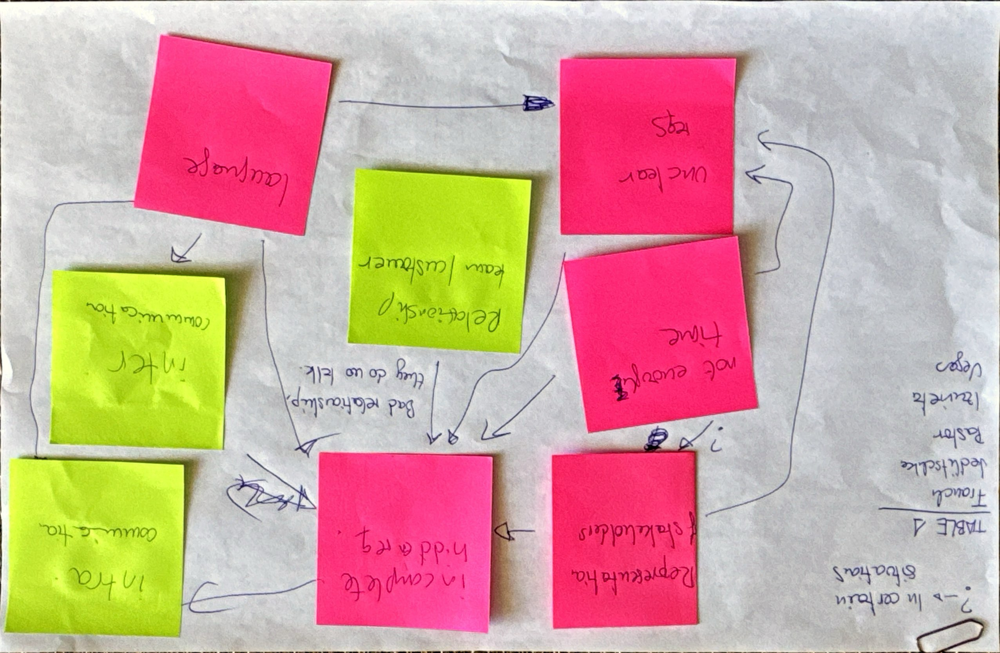

```{r setup, include=FALSE}
knitr::opts_chunk$set(echo = TRUE)

library(tidyverse)
library(patchwork)
library(ggdag)
```

This file contains the analysis of one of the causal propositions formulated by participants in the [interactive session at ISERN'25](https://conf.researchr.org/details/esem-2025/esem-2025-isern---annual-meeting-/4/Naming-the-Pain-in-Requirements-Engineering-NaPiRE-).

## Proposition

Xavi Franch, Andreas Jedlitschka, Oscar Pastor, Clemente Izurieta and Sira Vegas proposed the following proposition.



### Variables

This proposition contains the following variables from the available variable catalogs (where the "Group"-column refers to the respective cluster of variables):

| Code | Group | Description | Variable |
|---|---|---|---|
| `representation` | Problems | An important stakeholder is not represented in our project | `v_405` |
| `time` | Problems | We do not have enough time to carry out tasks | `v_399` |
| `hidden` | Problems | Incomplete or hidden requirements | `v_388` |
| `unclear` | Problems | Unclear or unmeasurable non-functional requirements | `v_403` |
| `language` | Problems | Language barriers | `v_406` |
| `relationship` | Communication | How would you rate the relationship between your project's team and its customer? | `v_25` |
| `comm.intra` | Communication | How would you rate the quality of communication inside your team? | `v_359` |
| `comm.inter` | Communication | How would you rate the quality of communication between your team and other teams on the same project? | `v_452` |

### Directed Acyclic Graph

The proposition can be formalized as the following directed, acyclic graph (DAG).

```{r specify-dag}
dag <- dagify(
  hidden ~ representation + time + unclear + relationship + language + comm.inter,
  representation ~ time,
  unclear ~ representation + time + language,
  comm.inter ~ language,
  comm.intra ~ hidden,

  exposure = "hidden",
  outcome = "comm.intra",
  
  labels = c(
    representation = "representation", time = "time", hidden = "hidden", unclear = "unclear",
    language = "language", relationship = "relationship", comm.intra = "comm.intra", comm.inter = "comm.inter"
  ),
  coords = list(
    x = c(representation = 0, hidden = 1, comm.intra = 2, 
          time = 0, relationship = 1, comm.inter = 2,
          unclear = 0, language = 2),
    y = c(representation = 2, hidden = 2, comm.intra = 2, 
          time = 1, relationship = 1, comm.inter = 1,
          unclear = 0, language = 0)
  )
)

 ggdag_status(dag, use_labels = "label", text = FALSE) +
   theme_dag() +
   theme(legend.position = "bottom") +
   labs(fill = "Variable type", color = "Variable type")
```

The participants commented on the following relationships on their contribution:

- $\text{time} \rightarrow \text{representation}$: "in certain situations"
- $\text{relationship} \rightarrow \text{hidden}$: "bad relationship, they do no talk."
