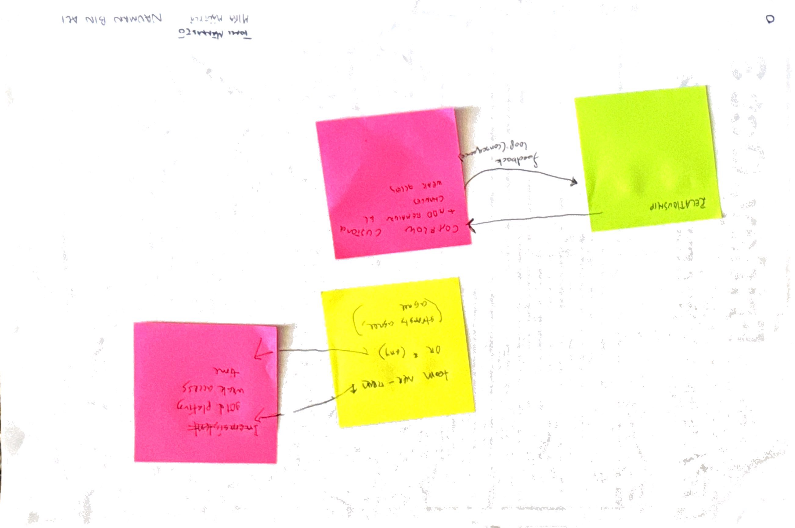

```{r setup, include=FALSE}
knitr::opts_chunk$set(echo = TRUE)

library(tidyverse)
library(patchwork)
library(ggdag)
```

This file contains the analysis of one of the causal propositions formulated by participants in the [interactive session at ISERN'25](https://conf.researchr.org/details/esem-2025/esem-2025-isern---annual-meeting-/4/Naming-the-Pain-in-Requirements-Engineering-NaPiRE-).

## Proposition

Mika Mäntylä, Nauman bin Ali, and Tomi Männistö proposed the following propositions.



### Variables

This proposition contains the following variables from the available variable catalogs (where the "Group"-column refers to the respective cluster of variables):

| Code | Group | Description | Variable |
|---|---|---|---|
| `team-overrun` | Analysis | The project members collectively agreed that if we don't start implementation now, we would not finish implementation in time. | `v_566` |
| `gold-plating` | Problems | Gold plating (implementation of features without corresponding requirements) | `v_395` |
| `weak-access` | Problems | Weak access to customer needs and / or (internal) business information | `v_396` |
| `time` | Problems | We do not have enough time to carry out tasks | `v_399` |
| `relationship` | Communication | How would you rate the relationship between your project's team and its customer? | `v_25` |
| `comflaw-customer` | Problems | Communication flaws between the project and the customer | `v_386` | 
| `changes` | Problems | Changes in requirements are not communicated | `v_410` |

### Directed Acyclic Graph

The proposition can be formalized as the two following directed, acyclic graphs (DAGs).

```{r specify-dag-6a}
dag6a <- dagify(
  gold.plating ~ team.overrun,
  weak.access ~ team.overrun,
  time ~ team.overrun,

  exposure = "team.overrun",
  outcome = c("gold.plating", "weak.access", "time"),
  
  labels = c(
    team.overrun = "team-overrun", gold.plating = "gold-plating", weak.access = "weak-access", time = "time"
  ),
  coords = list(
    x = c(team.overrun = 0, gold.plating = 1, weak.access = 1, time = 1),
    y = c(team.overrun = 1, gold.plating = 2, weak.access = 1, time = 0)
  )
)

 ggdag_status(dag6a, use_labels = "label", text = FALSE) +
   theme_dag() +
   theme(legend.position = "bottom") +
   labs(fill = "Variable type", color = "Variable type")
```

```{r specify-dag-6b}
dag6b <- dagify(
  comflaw.customer ~ relationship,
  changes ~ relationship,
  weak.access ~ relationship,

  exposure = "relationship",
  outcome = c("comflaw.customer", "changes", "weak.access"),
  
  labels = c(
    relationship = "relationship", comflaw.customer = "comflaw-customer", weak.access = "weak-access", changes = "changes"
  ),
  coords = list(
    x = c(relationship = 0, comflaw.customer = 1, weak.access = 1, changes = 1),
    y = c(relationship = 1, comflaw.customer = 2, weak.access = 1, changes = 0)
  )
)

 ggdag_status(dag6b, use_labels = "label", text = FALSE) +
   theme_dag() +
   theme(legend.position = "bottom") +
   labs(fill = "Variable type", color = "Variable type")
```

The participants commented on the following relationships on their contribution:

- $\text{comflaw-customer}/\text{weak-access}/\text{changes} \rightarrow \text{relationship}$: "feedback loop (consequence)"

This indicates the assumption of a time-dependent feedback loop.
Since the data collected during the survey is not longitudinal for each subject, we exclude this relationship from the DAG.
